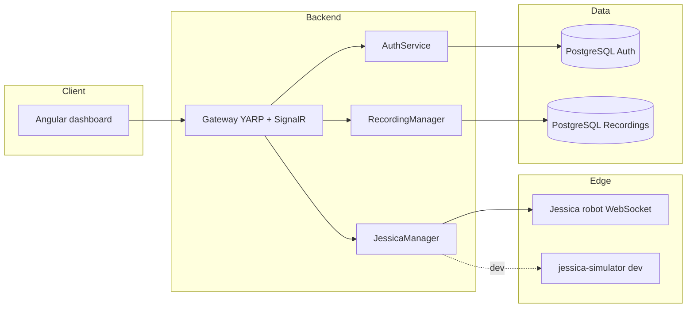

# Jessica · HIT

**Solar-powered, field-friendly mobility for smarter farming.**

Jessica is an eco-conscious robotic platform on wheels designed to move **along** agricultural land—**not** on top of growing crops. Integrated solar panels help farmers unlock **additional revenue** from their fields in a clean, intelligent way: energy where the sun already shines, stewardship where the soil already feeds us.

---

## Why Jessica?

| Challenge | How Jessica helps |
|-----------|-------------------|
| Land is finite | Dual use: mobility and **solar harvest** without sacrificing crop rows |
| Climate & margins | Lower-carbon footprint and **new income streams** alongside traditional yield |
| Soil & plants | **Elevated / row-aware paths**—respect the canopy and root zone; work *with* the field, not over it |

> *The goal is simple: more value per hectare, with a lighter touch on the environment.*

---

## What this repository contains

This monorepo is the **software control plane** for Jessica: authentication, API gateway, robot telemetry and commands, recordings, and a web dashboard for operators and researchers.



| Area | Role |
|------|------|
| **Aspire.AppHost** | Orchestrates Postgres, Gateway, JessicaManager, AuthService, and RecordingManager for local and cloud-style development. |
| **Gateway** | Single entry point (routing, JWT, CORS, SignalR hub for live status). |
| **JessicaManager** | Connects to the robot (or simulator) over **WebSocket**; forwards move/stop and ingests telemetry. |
| **AuthService** | Users, roles, and tokens backed by PostgreSQL. |
| **RecordingManager** | Recordings and events API backed by PostgreSQL. |
| **Frontend** | Angular 18 + NgRx + PrimeNG + SignalR for a responsive operator UI. |
| **jessica-simulator** | Python `websockets` server that mimics the robot protocol for **local development without hardware**. |

---

## Tech stack

- **.NET 9** — services and Aspire orchestration  
- **PostgreSQL** — separate databases for auth and recordings (with optional pgAdmin via Aspire)  
- **YARP** — gateway reverse proxy  
- **SignalR** — real-time updates to the browser  
- **Angular 18** — SPA dashboard  
- **Python 3** + **websockets** — robot simulator  

---

## Prerequisites

- [.NET 9 SDK](https://dotnet.microsoft.com/download)  
- [Node.js 20+](https://nodejs.org/) (for the Angular app)  
- [Python 3.11+](https://www.python.org/downloads/) (optional, for `jessica-simulator`)  
- **Docker** (recommended for Postgres when running the Aspire host)  

---

## Quick start

### 1. Backend (Aspire)

From the Aspire host project directory:

```bash
cd Backend/Aspire/Aspire.AppHost
dotnet run
```

This brings up the distributed application (databases, gateway, and related services).  
The default **robot WebSocket URL** parameter is `ws://127.0.0.1:8765`—run the simulator (below) or point `jessica-ws-url` at your real robot endpoint.

In **VS Code**, you can also use **Run and Debug** → `.NET Core Launch (console)` (see `.vscode/launch.json`).

### 2. Robot simulator (optional, local dev)

```bash
cd jessica-simulator
python -m venv .venv
.venv\Scripts\activate          # Windows
# source .venv/bin/activate     # macOS / Linux
pip install -r requirements.txt
python app.py
```

JessicaManager will connect as a **client**; the simulator accepts JSON commands (`move` / `stop`) and emits **telemetry** frames for the UI.

### 3. Frontend

```bash
cd Frontend
npm install
npm start
```

Open the URL printed by the Angular CLI (typically `http://localhost:4200`) and ensure it is allowed by **Gateway CORS** settings in `Backend/Gateway/appsettings.json`.

---

## Project layout (high level)

```
Jessica-HIT/
├── Backend/
│   ├── Aspire/Aspire.AppHost/     # Orchestration entry point
│   ├── Gateway/                   # API + SignalR + YARP
│   ├── JessicaManager/            # Robot WebSocket bridge
│   ├── AuthService/
│   ├── RecordingManager/
│   └── Common/
├── Frontend/                      # Angular SPA
└── jessica-simulator/             # Dev-only WebSocket “robot”
```

---

## Vision in one line

**Jessica turns sunlight and careful paths into opportunity for farmers—clean energy, smart software, and wheels that know where *not* to tread.**

---

## Contributing & team

This project is developed in the **HIT** context. For branches, reviews, and deployment specifics, follow your team’s internal guidelines.

---

<p align="center">
  <sub>Built for fields, farmers, and a more sustainable harvest.</sub>
</p>
