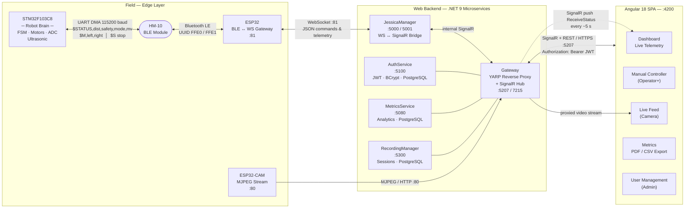

# Jessica — Solar-Powered Agrivoltaic Robot System

> **Agrivoltaics meets robotics.** Jessica is a solar-powered agricultural robot that autonomously navigates over crops on a linear rail, simultaneously generating clean energy and enabling remote precision agriculture — all monitored and controlled through a real-time web dashboard.

<br>

**Students:** Lidor Elmakaies · Amit Leiba · Matan Heinrich
**Institution:** HIT — Holon Institute of Technology
**Year:** 2025–2026

---

## Table of Contents

- [The Problem &amp; Solution](#the-problem--solution)
- [System Architecture](#system-architecture)
- [Repository Layout](#repository-layout)
- [End-to-End Communication](#end-to-end-communication)
- [Tech Stack](#tech-stack)
- [Features](#features)
- [Quick Start](#quick-start)
- [Configuration](#configuration)
- [API Reference](#api-reference)
- [Roles &amp; Security](#roles--security)
- [Non-Functional Requirements](#non-functional-requirements)

---

## The Problem & Solution

Agricultural land and solar energy generation are traditionally competing uses of the same ground. Dedicating land to solar panels means less land for crops — a real constraint as demand for both food and clean electricity grows.

**Jessica** solves this through **dynamic agrivoltaics**: a platform (the "train") carrying solar panels rolls autonomously along rails above a field. The panels generate electricity while moving in a controlled pattern that ensures crops below still receive adequate sunlight. A central web dashboard gives the farmer full visibility and control — live telemetry, manual override, energy production metrics, and security monitoring — from anywhere.

```
☀️  Solar panels on moving platform above crops
🌱  Crops grow underneath — light optimized by panel movement
⚡  Clean electricity generated and fed to the grid
📡  Farmer monitors and controls everything remotely
```

---

## System Architecture

```
┌─────────────────────────────────────────────────────────────────────────┐
│                          FIELD (Edge)                                   │
│                                                                         │
│   ┌──────────────┐   UART    ┌──────────────┐   BLE (HM-10)            │
│   │  STM32F103   │ ────────► │    ESP32     │ ◄──────────────────────┐ │
│   │  Robot Brain │  4 Hz     │  BLE Gateway │                        │ │
│   │              │           │  + WebSocket │                        │ │
│   └──────────────┘           └──────┬───────┘                        │ │
│        ▲ Motors / PWM               │ WebSocket :81                  │ │
│        │ Ultrasonic                 │ JSON                           │ │
│        │ Battery ADC                │                                │ │
└────────┼────────────────────────────┼────────────────────────────────┘ │
         │                            │                                   │
         │                     ┌──────▼────────────────────────────────┐ │
         │                     │            Web Backend (.NET 9)        │ │
         │                     │                                        │ │
         │                     │  ┌────────────────┐  ┌─────────────┐  │ │
         │                     │  │ JessicaManager │  │  AuthService│  │ │
         │                     │  │  :5000 / :5001 │  │   :5100     │  │ │
         │                     │  └────────┬───────┘  └─────────────┘  │ │
         │                     │           │           ┌─────────────┐  │ │
         │                     │  ┌────────▼───────┐   │  Metrics    │  │ │
         │                     │  │    Gateway     │   │  Service    │  │ │
         │                     │  │  YARP + SignalR│   │   :5080     │  │ │
         │                     │  │   :5207 / 7215 │   └─────────────┘  │ │
         │                     │  └────────┬───────┘  ┌─────────────┐  │ │
         │                     │           │           │  Recording  │  │ │
         │                     │           │           │  Manager    │  │ │
         │                     │           │           │   :5300     │  │ │
         │                     │           │           └─────────────┘  │ │
         │                     └───────────┼────────────────────────────┘ │
         │                                 │ SignalR + REST                │
         │                                 │                               │
         │                     ┌───────────▼──────────────────────────┐   │
         └─────────────────────│        Angular 18 SPA                │   │
                               │        (Frontend :4200)              │───┘
                               │  Dashboard · Controller · Metrics   │
                               └──────────────────────────────────────┘
```

### Network Architecture



---

## Repository Layout

```
Jessica-HIT/
│
├── Robot_STM32/                # STM32F103C8 robot firmware (C, Keil MDK-ARM)
│   ├── Project.uvprojx         # Keil project file
│   ├── Hardware/               # Peripheral drivers (motors, ultrasonic, UART DMA)
│   └── Core/                   # FSM super-loop, SysTick, main application logic
│
├── Robot_Gateway_ESP32/        # ESP32 BLE ↔ WebSocket bridge (C++, PlatformIO)
│   ├── platformio.ini
│   └── src/
│       └── main.cpp            # WiFi, BLE client, WebSocket server, JSON bridge
│
└── Web/                        # Full-stack web application
    ├── Backend/                # .NET 9 microservices
    │   ├── docker-compose.yml  # All services + 3 PostgreSQL databases
    │   ├── Gateway/            # YARP reverse proxy + SignalR hub
    │   ├── AuthService/        # JWT auth, user management (BCrypt)
    │   ├── JessicaManager/     # WebSocket↔SignalR bridge
    │   ├── MetricsService/     # Sensor data collection & analytics
    │   ├── RecordingManager/   # Session recording CRUD
    │   └── Aspire/             # .NET Aspire orchestration (local dev)
    │
    ├── Frontend/               # Angular 18 SPA
    │   └── src/app/features/
    │       ├── auth/           # Login / Register
    │       ├── home/           # Main dashboard
    │       ├── manual-controller/   # Real-time robot controls
    │       ├── live-feed/      # Camera & telemetry feed
    │       ├── recorder/       # Session recording
    │       ├── metrics/        # Analytics & PDF/CSV export
    │       └── user-management/    # Admin user CRUD
    │
    └── jessica-simulator/      # Python WebSocket robot simulator
        ├── app.py              # Simulates robot on ws://localhost:8765
        └── requirements.txt
```

---

## End-to-End Communication

| Segment              | Protocol                  | Format                                          | Notes                |
| -------------------- | ------------------------- | ----------------------------------------------- | -------------------- |
| STM32 → ESP32       | UART (DMA ring buffer)    | `$STATUS,<dist>,<safety>,<mode>,<battery_mv>` | 4 Hz, non-blocking   |
| ESP32 ↔ STM32 (BLE) | Bluetooth LE (HM-10)      | Same as UART                                    | UUIDs FFE0/FFE1      |
| ESP32 ↔ Backend     | WebSocket `:81`         | JSON                                            | Bidirectional        |
| Frontend ↔ Backend  | SignalR + REST over HTTPS | JSON + JWT                                      | Gateway on `:5207` |

### Telemetry Message (ESP32 → Backend)

```json
{
  "type": "telemetry",
  "distance": 25,
  "safety": 1,
  "mode": 2,
  "battery": 3.3
}
```

### Command Messages (Backend → ESP32)

```json
{ "cmd": "move", "left": 150, "right": 150 }
{ "cmd": "stop" }
```

### UART Telemetry Format (STM32 → ESP32)

```
$STATUS,<distance_cm>,<safety_state>,<operating_mode>,<battery_mv>
Example: $STATUS,25,1,2,3300
```

**Safety states:** `0` = CLEAR · `1` = WARNING · `2` = CRITICAL (motors cut)
**Operating modes:** `0` = IDLE · `1` = MANUAL · `2` = AUTONOMOUS

---

## Tech Stack

### Embedded

| Layer           | Hardware                           | Technology                                   |
| --------------- | ---------------------------------- | -------------------------------------------- |
| Robot brain     | STM32F103C8 (72 MHz ARM Cortex-M3) | C, Keil MDK-ARM, non-blocking FSM super-loop |
| BLE bridge      | ESP32 dev board                    | Arduino (C++), PlatformIO                    |
| Wireless        | HM-10 BLE module                   | UUIDs FFE0/FFE1, fixed MAC                   |
| Distance sensor | HC-SR04 ultrasonic                 | EXTI interrupt, non-blocking                 |
| Motors          | Dual H-bridge                      | Independent left/right PWM                   |
| LEDs            | WS2812B RGB strip                  | Bit-bang protocol                            |

### Backend

| Service          | Port        | Technology                                           |
| ---------------- | ----------- | ---------------------------------------------------- |
| Gateway          | 5207 / 7215 | .NET 9, YARP 2.3.0, SignalR, JWT middleware          |
| AuthService      | 5100        | .NET 9, EF Core 9, BCrypt, PostgreSQL 16             |
| JessicaManager   | 5000 / 5001 | .NET 9, System.Net.WebSockets, SignalR               |
| MetricsService   | 5080        | .NET 9, EF Core 9, background worker, PostgreSQL 16  |
| RecordingManager | 5300        | .NET 9, EF Core 9, PostgreSQL 16                     |
| Orchestration    | —          | .NET Aspire (local dev), Docker Compose (production) |

### Frontend

| Aspect           | Technology                                             |
| ---------------- | ------------------------------------------------------ |
| Framework        | Angular 18 (standalone components)                     |
| Language         | TypeScript 5.4                                         |
| State management | NgRx 18 (`auth`, `car`, `recording` slices)      |
| Real-time        | @microsoft/signalr 10                                  |
| UI library       | PrimeNG 18 + PrimeFlex 4                               |
| Charts & export  | jsPDF 4.2.1, jspdf-autotable, Chart.js                 |
| HTTP             | RxJS 7.8, Angular interceptors (auto Bearer injection) |

---

## Features

### Robot Firmware (STM32)

- **Non-blocking architecture** — 1 ms SysTick tick, FSM super-loop (no RTOS)
- **Three-state safety supervisor** — CLEAR / WARNING / CRITICAL; automatically cuts PWM when an obstacle is detected
- **Autonomous mode** — robot drives forward, detects end of track, reverses automatically
- **Manual mode** — responds to `$M,<left>,<right>` commands over UART/BLE with < 2 s latency
- **Emergency stop** — `$S` command cuts motors immediately
- **Battery monitoring** — ADC reading forwarded in every telemetry packet
- **DMA UART** — ring-buffer-based non-blocking serial receive

### Gateway Firmware (ESP32)

- **BLE client** — connects to STM32 HM-10 module and subscribes to telemetry notifications
- **WebSocket server** on port 81 — multiple simultaneous clients supported
- **Bidirectional bridging** — BLE notifications translated to JSON telemetry sent to backend; incoming WebSocket commands written back to BLE

### Web Dashboard

- **Live telemetry** — distance, battery voltage, safety state, operating mode refreshed every 5 s via SignalR
- **Manual controller** — forward/backward controls with immediate stop, operator-role-gated
- **Autonomous mode toggle** — switch between manual and autonomous from the dashboard
- **Obstacle alert** — audible warning triggered when an obstacle is detected in front of the robot
- **Energy metrics** — current production (kW) and daily generation (kWh) displayed as widgets
- **Historical analytics** — hourly / daily / monthly energy production charts
- **PDF & CSV export** — one-click export of monthly reports (PDF) and raw sensor data (CSV)
- **Recording sessions** — start, stop, and review drive sessions with timestamps
- **User management** — Admin can create, edit, and delete Operator/Viewer accounts
- **Responsive design** — works on desktop and mobile

### Security

- **JWT authentication** — HS256 tokens; access token 15 min, refresh token 7 days
- **Role-based access control** — Admin, Operator, Viewer with route guards
- **BCrypt password hashing** — work factor 12
- **Rate limiting** on auth endpoints — 10 requests per 10 seconds
- **Environment-based secrets** — no credentials in source code

---

## Quick Start

### Prerequisites

| Tool                    | Version                |
| ----------------------- | ---------------------- |
| .NET SDK                | 9.0                    |
| Node.js                 | 20+                    |
| Docker & Docker Compose | latest                 |
| Python                  | 3.10+ (simulator only) |
| Keil MDK-ARM            | 5.x (STM32 only)       |
| PlatformIO              | latest (ESP32 only)    |

---

### Option A — Docker Compose (recommended for full stack)

```bash
# 1. Start all backend services + databases
cd Web/Backend
docker-compose up --build

# 2. Start the Angular dev server
cd ../Frontend
npm install
ng serve

# Open http://localhost:4200
```

Services started by Docker Compose:

| Service                 | URL                   |
| ----------------------- | --------------------- |
| Gateway (API + SignalR) | http://localhost:5207 |
| AuthService             | http://localhost:5100 |
| JessicaManager          | http://localhost:5000 |
| MetricsService          | http://localhost:5080 |
| RecordingManager        | http://localhost:5300 |
| Frontend (dev)          | http://localhost:4200 |

---

### Option B — .NET Aspire (local dev with dashboard)

```bash
cd Web/Backend/Aspire/Aspire.AppHost
dotnet run

# Aspire dashboard: http://localhost:15888
# Provides service discovery, health checks, and structured logs
```

---

### Option C — Robot Simulator (no hardware required)

The Python simulator speaks the same WebSocket JSON protocol as the real robot, so you can develop and test the full web stack without any hardware.

```bash
cd Web/jessica-simulator
pip install -r requirements.txt
python app.py
# WebSocket server running on ws://localhost:8765
```

Point `JessicaManager` at `ws://localhost:8765` instead of the ESP32's IP.

---

### Flashing the Embedded Firmware

**STM32 (Robot Brain)**

```
1. Open Robot_STM32/Project.uvprojx in Keil uVision 5
2. Build (F7)
3. Flash via ST-Link (F8)
4. Monitor serial output at 115200 baud
```

**ESP32 (BLE Gateway)**

```bash
cd Robot_Gateway_ESP32
pio run --target upload --upload-port COM3
pio device monitor --port COM3 --baud 115200
```

---

## Configuration

### ESP32 Gateway

Edit `Robot_Gateway_ESP32/src/main.cpp`:

```cpp
const char* ssid     = "YOUR_WIFI_SSID";
const char* password = "YOUR_WIFI_PASSWORD";
const char* bleAddress = "XX:XX:XX:XX:XX:XX";  // STM32 HM-10 MAC address
```

### Backend Services

Key environment variables (set in `docker-compose.yml` or `.env`):

| Variable                                 | Service                | Description                  |
| ---------------------------------------- | ---------------------- | ---------------------------- |
| `Jwt__SecretKey`                       | Gateway, AuthService   | Shared HS256 signing secret  |
| `Jwt__Issuer`                          | AuthService            | Token issuer string          |
| `ConnectionStrings__DefaultConnection` | Auth/Metrics/Recording | PostgreSQL connection string |
| `JessicaManager__RobotWebSocketUrl`    | JessicaManager         | `ws://<robot-ip>:81`       |

> **Never commit secrets.** Use `.env` files or your deployment platform's secret management.

---

## API Reference

All external-facing endpoints are routed through the **Gateway** (`localhost:5207`). Include `Authorization: Bearer <token>` on all protected routes.

### Authentication

| Method   | Path                   | Body                          | Description                     |
| -------- | ---------------------- | ----------------------------- | ------------------------------- |
| `POST` | `/api/auth/login`    | `{ email, password }`       | Returns access + refresh tokens |
| `POST` | `/api/auth/register` | `{ email, password, role }` | Admin only                      |
| `POST` | `/api/auth/refresh`  | `{ refreshToken }`          | Refresh access token            |

### Robot Control (Operator+)

| Method   | Path                    | Body                        | Description                          |
| -------- | ----------------------- | --------------------------- | ------------------------------------ |
| `POST` | `/api/car/move`       | `{ left, right }`         | Set individual wheel speeds (0–255) |
| `POST` | `/api/car/stop`       | —                          | Emergency stop                       |
| `POST` | `/api/car/autonomous` | `{ enabled: true\|false }` | Toggle autonomous mode               |

### Metrics (Operator+)

| Method  | Path                        | Description                |
| ------- | --------------------------- | -------------------------- |
| `GET` | `/api/metrics`            | All stored sensor readings |
| `GET` | `/api/metrics?from=&to=`  | Filter by date range       |
| `GET` | `/api/metrics/export/csv` | Download raw data as CSV   |

### Recording Sessions (Operator+)

| Method   | Path                      | Description          |
| -------- | ------------------------- | -------------------- |
| `GET`  | `/api/recordings`       | List all sessions    |
| `POST` | `/api/recordings/start` | Start a new session  |
| `POST` | `/api/recordings/stop`  | Stop current session |

### User Management (Admin only)

| Method     | Path                | Description    |
| ---------- | ------------------- | -------------- |
| `GET`    | `/api/users`      | List all users |
| `POST`   | `/api/users`      | Create user    |
| `PUT`    | `/api/users/{id}` | Update user    |
| `DELETE` | `/api/users/{id}` | Delete user    |

### SignalR Hub

**Hub URL:** `wss://localhost:5207/hubs/jessica`

| Event (server → client) | Payload                                 | Description                      |
| ------------------------ | --------------------------------------- | -------------------------------- |
| `ReceiveStatus`        | `{ distance, safety, mode, battery }` | Live telemetry pushed ~every 5 s |
| `ReceiveAlert`         | `{ type, message }`                   | Obstacle / system alerts         |

---

## Roles & Security

| Role               | Robot Control | Live Feed | Metrics        | User Management |
| ------------------ | ------------- | --------- | -------------- | --------------- |
| **Admin**    | ✅            | ✅        | ✅             | ✅              |
| **Operator** | ✅            | ✅        | ✅             | ❌              |
| **Viewer**   | ❌            | ✅        | ✅ (read-only) | ❌              |

- Passwords hashed with **BCrypt** (work factor 12) — no plaintext ever stored
- JWT tokens validated on **every** request at the Gateway before routing to any microservice
- Auth endpoints rate-limited to prevent brute-force attacks
- All sensitive configuration (secrets, connection strings) stored in environment variables

---

## Non-Functional Requirements

| Category                     | Target                                         |
| ---------------------------- | ---------------------------------------------- |
| Dashboard load time          | < 3 seconds                                    |
| Telemetry refresh rate       | Every 5 seconds                                |
| Video feed latency           | < 1 second (good network conditions)           |
| Manual control latency       | < 2 seconds end-to-end                         |
| System uptime                | 99.9%                                          |
| Autonomous controller uptime | 100% (runs locally, offline-capable)           |
| Supported concurrent farms   | Hundreds (cloud backend horizontally scalable) |
| Supported concurrent robots  | Thousands                                      |

### Offline Resilience

The robot operates **fully autonomously without internet**. The local STM32 controller handles navigation, safety, and motor control independently. If the WebSocket connection to the backend drops:

- The robot continues its last operating mode
- Sensor readings are cached locally on the ESP32
- The web dashboard shows a disconnected state and reconnects automatically

---

## Sub-project Documentation

For deeper technical documentation on each layer:

- [Robot_STM32/CLAUDE.md](Robot_STM32/CLAUDE.md) — Embedded firmware architecture, FSM states, peripheral drivers
- [Robot_Gateway_ESP32/CLAUDE.md](Robot_Gateway_ESP32/CLAUDE.md) — BLE/WiFi bridge, WebSocket protocol details
- [Web/CLAUDE.md](Web/CLAUDE.md) — Backend microservices, frontend architecture, deployment

---

*Jessica — HIT Final Project 2025–2026*
